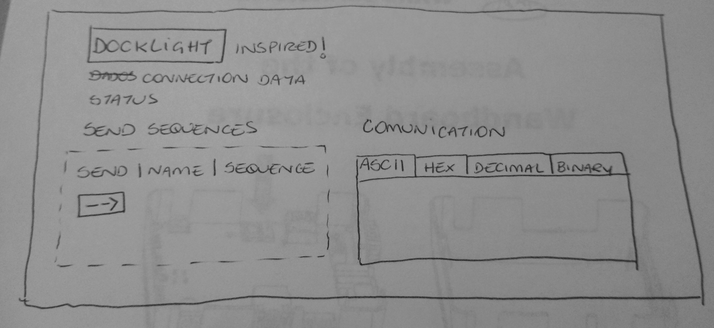

# protocol-sniffer
A tool to receive and send bytes over serial port.

It was inspired by docklight tool, this is the wireframe made by me own.



## Install:

To run this project just type:

```
$ pip -r requirements.txt
$ ./main.py
```